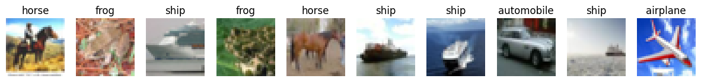
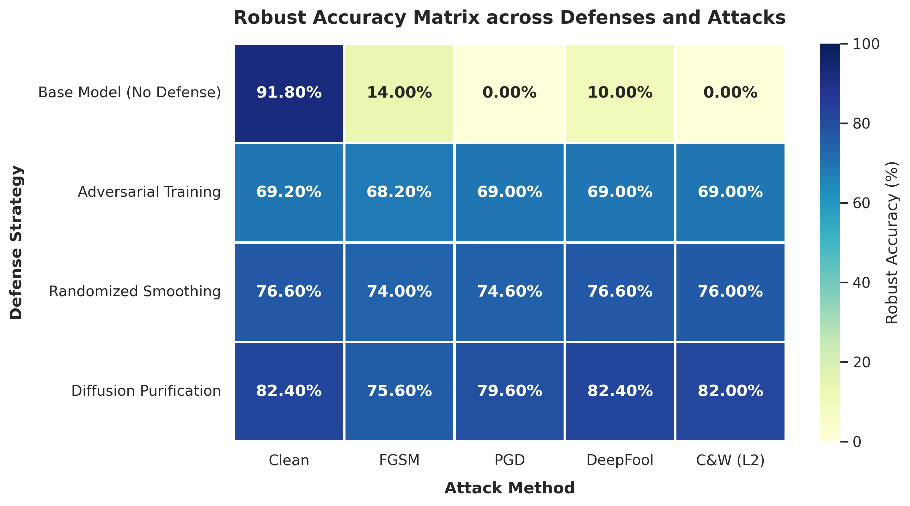

# 🛡️ Adversarial Robustness Benchmark: White-Box Attacks, Defense Paradigms & Diffusion Purification in Deep Learning



This repository contains an end-to-end PyTorch framework for designing, implementing, and benchmarking adversarial attacks, empirical and certified defense mechanisms, and generative diffusion purification models on deep neural networks. Built on top of CIFAR-10 and a pre-trained ResNet-20 architecture, all attack vectors and defenses are implemented natively from mathematical first principles in a unified workspace without relying on high-level attack libraries (such as `Foolbox` or `Torchattacks`).

### 👤 Authors & Context
* **Developers:** [Arvin Baghal Asl](https://github.com/arvinasli) & [Arash Akbari](https://github.com/brokearash)
* **Institution:** Sharif University of Technology (SUT)
* **Course:** Artificial Intelligence
* **Dataset:** CIFAR-10 ($60,000$ $32 \times 32$ RGB images, 10 classes)

---

## 🏗 Notebook Architecture & Pipeline Flow

The codebase is self-contained within a single, structured Jupyter Notebook (`adversarial_robustness.ipynb`) divided into four sequential execution modules:

* **1️⃣ Model Architecture & Input Space Modeling:** Encapsulates ResNet-20 with an embedded normalization wrapper for direct $[0, 1]$ pixel-space perturbations.
* **2️⃣ Native White-Box Attack Engine:** Pure PyTorch autograd implementations of FGSM, PGD-20, DeepFool, and Carlini & Wagner ($L_2$).
* **3️⃣ Multi-Layered Defense Implementations:** Empirical Adversarial Training, mathematical Randomized Smoothing, and generative Diffusion Purification (DiffPure).
* **4️⃣ Evaluation & Analytics Workspace:** Cross-evaluation robustness matrices, Seaborn heatmap generation, perturbation sample visualizers, and trade-off analysis.

---

### 1️⃣ Model Encapsulation & Input Space Integrity
To ensure strict physical noise budgeting, adversarial perturbations are computed directly in unnormalized pixel space $[0, 1]$.
* **Raw Pixel Space:** Images are loaded into memory strictly in the range $[0, 1]$ by dividing raw RGB values by $255$.
* **Integrated Normalization Wrapper:** A custom PyTorch `Normalize` module is prepended to the ResNet-20 network architecture, computing $x_{\text{norm}} = \frac{x - \mu}{\sigma}$ internally during forward passes:

$$
\text{model} = \text{Sequential}(\text{Normalize}(), \text{ResNet20}())
$$

* **Benefit:** Allows attacks to optimize perturbations directly on raw inputs while standardizing inputs right before model layer executions.

---

### 2️⃣ White-Box Adversarial Attack Suite
Four distinct gradient-driven attack algorithms implemented natively using PyTorch autograd:

#### 🔹 Fast Gradient Sign Method (FGSM — $L_\infty$)
A one-step adversarial generation method computing perturbations along the loss landscape sign gradient:

$$
x_{\text{adv}} = \text{clip}_{[0,1]}\left(x + \epsilon \cdot \text{sign}(\nabla_x L(\theta, x, y))\right)
$$

* **Evaluated Budgets:** Tested under noise bounds $\epsilon \in \{2/255, 4/255, 8/255, 16/255\}$ to plot degradation curves.

#### 🔹 Projected Gradient Descent (PGD-20 — $L_\infty$)
An iterative multi-step attack with random uniform initialization inside the $\epsilon$-ball to break gradient symmetry:

$$
x^0 = x + \mathcal{U}(-\epsilon, \epsilon), \quad x^{t+1} = \Pi_{x+\mathcal{B}_\epsilon}\left(x^t + \alpha \cdot \text{sign}(\nabla_{x^t} L(\theta, x^t, y))\right)
$$

* **Configuration:** 20 iterations, step size $\alpha$, random restart, and per-step clipping to $[0, 1]$ bounds under budget $\epsilon = 8/255$.

#### 🔹 DeepFool Attack ($L_2$)
An iterative boundary-seeking projection attack that finds the minimum $L_2$ perturbation required to push an image across the classification decision boundary:
* **Mechanism:** Linearizes the decision boundaries around the current point at each step and pushes the image toward the closest hyperplane.
* **Configuration:** Iterates up to 50 steps until prediction flips; reports mean $L_2$ norm $\|\delta\|_2$ across successful adversarial samples.

#### 🔹 Carlini & Wagner Attack (C&W — $L_2$)
An optimization-based attack formulating adversarial generation as a constrained objective:

$$
\min_\delta \|\delta\|_2^2 + c \cdot f(x+\delta)
$$

where the objective function $f(x')$ is defined over network logits $Z(x')$ with confidence parameter $\kappa$:

$$
f(x') = \max\left(Z(x')_y - \max_{i \neq y} Z(x')_i, -\kappa\right)
$$

* **Change-of-Variable:** Enforces strict $[0, 1]$ clipping without non-differentiable operations using an auxiliary variable $w$:

$$
x + \delta = \frac{1}{2}\left(\tanh(w) + 1\right)
$$

* **Optimization Setup:** Optimized via Adam over 100 iterations.

---

### 3️⃣ Defensive Mechanism & Robust Fine-Tuning Paradigms

#### 🛡️ Adversarial Training (Empirical Defense)
Fine-tunes the base model against dynamic adversarial perturbations by solving a min-max robust optimization problem:

$$
\min_\theta \mathbb{E}_{(x,y)} \left[\max_{\delta \in \mathcal{B}_\epsilon} L(\theta, x+\delta, y)\right]
$$

* **Implementation:** Generates 10-step PGD adversarial samples for each mini-batch in real-time and updates model weights for 5 to 10 fine-tuning epochs on CIFAR-10.

#### 🛡️ Randomized Smoothing (Certified Defense)
Provides provable mathematical guarantees by constructing a smoothed classifier $g(x)$ via majority voting over Gaussian-perturbed inputs:

$$
g(x) = \arg\max_c \mathbb{P}\left(f(x+\varepsilon) = c\right), \quad \varepsilon \sim \mathcal{N}(0, \sigma^2 I)
$$

* **Implementation:** Generates $N=100$ noisy samples per test image with standard deviation $\sigma = 0.25$. Evaluated using a base ResNet-20 model pre-fine-tuned on Gaussian noise.

#### 🛡️ Diffusion Purification (DiffPure — Generative Defense)
Purifies adversarial noise by passing noisy inputs through a pre-trained generative diffusion model (`google/ddpm-cifar10-32` via HuggingFace `diffusers`) before classification:
* **Forward Process (Noise Injection):** Adds small Gaussian noise at timestep $t=50$ to drown out structured adversarial perturbations:

$$
x_t = \sqrt{\bar{\alpha}_t} x_{\text{adv}} + \sqrt{1 - \bar{\alpha}_t} \varepsilon, \quad \varepsilon \sim \mathcal{N}(0, I)
$$

* **Reverse Process (Generative Denoising):** Solves the reverse SDE from $t$ down to $0$ to reconstruct a clean image instance before feeding it into ResNet-20.

---

### 4️⃣ Comprehensive Evaluation & Visual Analytics
* **Robustness Matrix & Heatmaps:** Generates cross-evaluation tables and Seaborn color-mapped heatmaps comparing clean accuracy and robust accuracy across all model-attack combinations.
* **Visual Inspection Suite:** Visualizes sample trios: (a) Original Image, (b) $10\times$ Magnified Noise $\delta$, and (c) Final Adversarial Image, displaying predicted class labels and confidence scores.
* **Trade-Off Analysis:**
  * **Robust Overfitting:** Analyzes performance divergence between training adversarial accuracy and test robust accuracy.
  * **DiffPure Latency Trade-off:** Benchmarks computational inference overhead of 50-step diffusion purification against robust accuracy gains.
  * **Randomized Smoothing Penalty:** Evaluates the trade-off between mathematical robustness guarantees and clean test set accuracy drops.

---

### 5️⃣ 🏆 Bonus Challenge: Competition-Grade Robust Optimization
Achieved best competitive robust accuracy by optimizing Adversarial Training parameters specifically against Carlini & Wagner ($L_2$) attacks, balancing margin scaling and perturbation loss weighting.

---

## 📊 Evaluation & Defense Matrix



---

## 🚀 Getting Started

### 1. Prerequisites
Ensure Python 3.10+ and PyTorch are configured with CUDA support:
```bash
pip install torch torchvision diffusers transformers huggingface_hub matplotlib seaborn scikit-learn
```

---

## 📝 License
This repository is licensed under the MIT License - see the [LICENSE](LICENSE) file for details.
